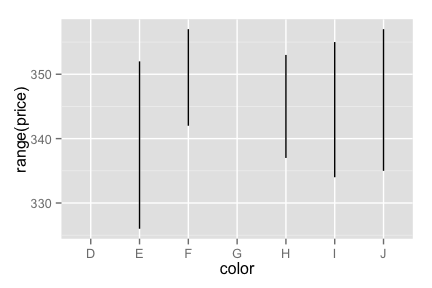

ffplot
======

`ffplot` is the fast, friendly plotting command for R.

`ffplot` is a simple and intuitive frontend around `ggplot2`. The goal
is that you can use it without thinking or looking up documentation.

Status: totally alpha! Download and enjoy.

Install
-------

    library(devtools)
    install_github("hughjonesd/ffplot")

Examples
--------

    library(ffplot)
    library(ggplot2)

    ## 
    ## Attaching package: 'ggplot2'
    ## 
    ## The following object is masked from 'mtcars':
    ## 
    ##     mpg

    data(diamonds)
    d30 <- diamonds[1:30,]
    head(d30)

    ##   carat       cut color clarity depth table price    x    y    z
    ## 1  0.23     Ideal     E     SI2  61.5    55   326 3.95 3.98 2.43
    ## 2  0.21   Premium     E     SI1  59.8    61   326 3.89 3.84 2.31
    ## 3  0.23      Good     E     VS1  56.9    65   327 4.05 4.07 2.31
    ## 4  0.29   Premium     I     VS2  62.4    58   334 4.20 4.23 2.63
    ## 5  0.31      Good     J     SI2  63.3    58   335 4.34 4.35 2.75
    ## 6  0.24 Very Good     J    VVS2  62.8    57   336 3.94 3.96 2.48

Simple scatterplots:

    ffplot(price ~ carat, d30)

Plot numeric data by categories:

    ffplot(price ~ color, d30)

Barplot of categorical data:

    ffplot(cut ~ color, d30)

Density plot, if right hand side is numeric:

    ffplot(cut ~ depth, d30)

Plot a function of your data:

    ffplot(range(price) ~ color, d30)

`ffplot` tries to guess what you want:

    ffplot(ci(price, 0.95) ~ color, d30)

    ## Warning: Removed 4 rows containing missing values (stat_summary).

Plot data with summary statistics:

    ffplot(price + mean(price) ~ color, d30)

Use any functions:

    ffplot(mean(price) + ci(price, .99) ~ color, d30)

    ## Warning: Removed 4 rows containing missing values (stat_summary).

Barplot with confidence intervals:

    ffplot(mean(price) + ci(price, .99) ~ color, d30, geom = c("bar", "errorbar"), col = "orange")

    ## Warning: Removed 4 rows containing missing values (stat_summary).

Add `ggplot2` options:

    ffplot(cut ~ color, diamonds) + scale_fill_grey()

Plus, bonus `fftable` function:

    fftable(range(carat) ~ color, diamonds)

    ##      D    E    F    G    H    I    J
    ## A 0.20 0.20 0.20 0.23 0.23 0.23 0.23
    ## B 3.40 3.05 3.01 3.01 4.13 4.01 5.01

TODO
----

-   Auto-smoothing for continuous x variables.
-   Better ability to override defaults; probably something like:

<!-- -->

    ffplot(violin(carat) + point(mean(carat)) ~ color, diamonds)

-   More geoms
-   Confidence interval function for binomial data
-   Facetting
