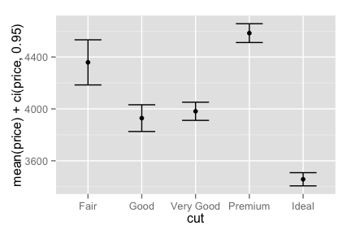
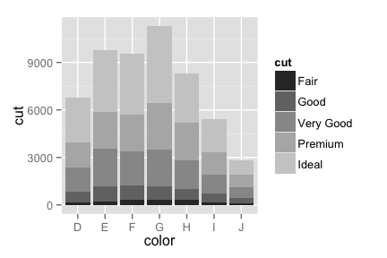

`ffplot` is a simple and intuitive plotting command. The goal is that
you can use it without thinking or looking up documentation.

Status: totally alpha! Download and enjoy.

Install
-------

    library(devtools)
    install_github("hughjonesd/ffplot")

Examples
--------

The basic form of every `ffplot` command is:

    ffplot(y_variables ~ x_variable, data)

The data is split up by unique values of x, and y variables are
calculated. We'll demonstrate using the `diamonds` data from ggplot2.

    library(ffplot)
    data(diamonds, package = "ggplot2")
    d30 <- diamonds[1:30,]
    head(d30)

    ##   carat       cut color clarity depth table price    x    y    z
    ## 1  0.23     Ideal     E     SI2  61.5    55   326 3.95 3.98 2.43
    ## 2  0.21   Premium     E     SI1  59.8    61   326 3.89 3.84 2.31
    ## 3  0.23      Good     E     VS1  56.9    65   327 4.05 4.07 2.31
    ## 4  0.29   Premium     I     VS2  62.4    58   334 4.20 4.23 2.63
    ## 5  0.31      Good     J     SI2  63.3    58   335 4.34 4.35 2.75
    ## 6  0.24 Very Good     J    VVS2  62.8    57   336 3.94 3.96 2.48

Here's a simple scatterplot.

    ffplot(price ~ carat, diamonds)

If x and y are not numeric, we get a barplot by default. We'll see how
to change this later.

    ffplot(cut ~ color, diamonds) 

If y is not numeric but x is, you get a density plot:

    ffplot(cut ~ depth, diamonds, position = "fill") 

y variables can also be functions of your data. `ffplot` tries to choose
an appropriate way to display results:

    ffplot(range(price) ~ color, d30) 

Of course x variables can be functions too:

    ffplot(price ~ cut(carat, 5), diamonds) 

If you want to use a different plot type, just put it on the left:

    ffplot(boxplot(price) ~ cut, diamonds)

You combine plots by adding terms. Here's a smooth line:

    ffplot(price + smooth(price) ~ carat, diamonds) 

    ## geom_smooth: method="auto" and size of largest group is >=1000, so using gam with formula: y ~ s(x, bs = "cs"). Use 'method = x' to change the smoothing method.

Here we draw means and confidence intervals. `ffplot` guesses that you
want error bars for the built-in `ci` function:

    ffplot(mean(price) + ci(price, 0.95) ~ cut, diamonds) 

You can add `ggplot` options to the plot:

    ffplot(price ~ carat, d30, shape = 3, color = "darkgreen")

Or you can add options for each y variable. If so, you'll need to
specify the `geom` explicitly:

    ffplot(point(price, alpha = 0.2, color = "red") + smooth(price, color = "orange", size = 2, se = TRUE) ~ carat, diamonds)

    ## geom_smooth: method="auto" and size of largest group is >=1000, so using gam with formula: y ~ s(x, bs = "cs"). Use 'method = x' to change the smoothing method.

To create facets, just put them in the formula after a vertical bar:

    ffplot(price ~ carat | color, diamonds)

Two-way facets:

    ffplot(smooth(mean(price)) ~ carat | color + cut, diamonds)

    ## geom_smooth: method="auto" and size of largest group is <1000, so using loess. Use 'method = x' to change the smoothing method.
    ## geom_smooth: method="auto" and size of largest group is <1000, so using loess. Use 'method = x' to change the smoothing method.
    ## geom_smooth: method="auto" and size of largest group is <1000, so using loess. Use 'method = x' to change the smoothing method.
    ## geom_smooth: method="auto" and size of largest group is <1000, so using loess. Use 'method = x' to change the smoothing method.
    ## geom_smooth: method="auto" and size of largest group is <1000, so using loess. Use 'method = x' to change the smoothing method.
    ## geom_smooth: method="auto" and size of largest group is <1000, so using loess. Use 'method = x' to change the smoothing method.
    ## geom_smooth: method="auto" and size of largest group is <1000, so using loess. Use 'method = x' to change the smoothing method.
    ## geom_smooth: method="auto" and size of largest group is <1000, so using loess. Use 'method = x' to change the smoothing method.
    ## geom_smooth: method="auto" and size of largest group is <1000, so using loess. Use 'method = x' to change the smoothing method.
    ## geom_smooth: method="auto" and size of largest group is <1000, so using loess. Use 'method = x' to change the smoothing method.
    ## geom_smooth: method="auto" and size of largest group is <1000, so using loess. Use 'method = x' to change the smoothing method.
    ## geom_smooth: method="auto" and size of largest group is <1000, so using loess. Use 'method = x' to change the smoothing method.
    ## geom_smooth: method="auto" and size of largest group is <1000, so using loess. Use 'method = x' to change the smoothing method.
    ## geom_smooth: method="auto" and size of largest group is <1000, so using loess. Use 'method = x' to change the smoothing method.
    ## geom_smooth: method="auto" and size of largest group is <1000, so using loess. Use 'method = x' to change the smoothing method.
    ## geom_smooth: method="auto" and size of largest group is <1000, so using loess. Use 'method = x' to change the smoothing method.
    ## geom_smooth: method="auto" and size of largest group is <1000, so using loess. Use 'method = x' to change the smoothing method.
    ## geom_smooth: method="auto" and size of largest group is <1000, so using loess. Use 'method = x' to change the smoothing method.
    ## geom_smooth: method="auto" and size of largest group is <1000, so using loess. Use 'method = x' to change the smoothing method.
    ## geom_smooth: method="auto" and size of largest group is <1000, so using loess. Use 'method = x' to change the smoothing method.
    ## geom_smooth: method="auto" and size of largest group is <1000, so using loess. Use 'method = x' to change the smoothing method.
    ## geom_smooth: method="auto" and size of largest group is <1000, so using loess. Use 'method = x' to change the smoothing method.
    ## geom_smooth: method="auto" and size of largest group is <1000, so using loess. Use 'method = x' to change the smoothing method.
    ## geom_smooth: method="auto" and size of largest group is <1000, so using loess. Use 'method = x' to change the smoothing method.
    ## geom_smooth: method="auto" and size of largest group is <1000, so using loess. Use 'method = x' to change the smoothing method.
    ## geom_smooth: method="auto" and size of largest group is <1000, so using loess. Use 'method = x' to change the smoothing method.
    ## geom_smooth: method="auto" and size of largest group is <1000, so using loess. Use 'method = x' to change the smoothing method.
    ## geom_smooth: method="auto" and size of largest group is <1000, so using loess. Use 'method = x' to change the smoothing method.
    ## geom_smooth: method="auto" and size of largest group is <1000, so using loess. Use 'method = x' to change the smoothing method.
    ## geom_smooth: method="auto" and size of largest group is <1000, so using loess. Use 'method = x' to change the smoothing method.
    ## geom_smooth: method="auto" and size of largest group is <1000, so using loess. Use 'method = x' to change the smoothing method.
    ## geom_smooth: method="auto" and size of largest group is <1000, so using loess. Use 'method = x' to change the smoothing method.
    ## geom_smooth: method="auto" and size of largest group is <1000, so using loess. Use 'method = x' to change the smoothing method.
    ## geom_smooth: method="auto" and size of largest group is <1000, so using loess. Use 'method = x' to change the smoothing method.
    ## geom_smooth: method="auto" and size of largest group is <1000, so using loess. Use 'method = x' to change the smoothing method.

`ffplot` returns a `ggplot` object, so you can add functions just as
with ggplot2.

    library(ggplot2)
    ffplot(cut ~ color, diamonds) + scale_fill_grey()

It's easy to use with `dplyr` or `magrittr`:

    library(dplyr)
    diamonds %>% ffplot(cut ~ color)

If you want to see what the underlying data looks like, there's the
`fftable` function:

    fftable(range(carat) ~ color, diamonds)

    ##   color range(carat).1 range(carat).2
    ## 1     D           0.20           3.40
    ## 2     E           0.20           3.05
    ## 3     F           0.20           3.01
    ## 4     G           0.23           3.01
    ## 5     H           0.23           4.13
    ## 6     I           0.23           4.01
    ## 7     J           0.23           5.01

Cookbook
--------

Plot proportions in a group:

    ffplot(hist(cut, position = "fill") ~ color, diamonds)

Barplot with confidence intervals:

    ffplot(bar(mean(price)) + ci(price, 0.99) ~ color, diamonds) 

Barplot of proportions with binomial confidence intervals:

    ffplot(prop(cut == "Ideal") + ci(cut == "Ideal") ~ color, diamonds)

Other ggplot2 `geoms` you can use:

    ffplot:::geom_names

    ##  [1] "point"     "line"      "errorbar"  "boxplot"   "bar"      
    ##  [6] "linerange" "violin"    "histogram" "density"   "smooth"   
    ## [11] "freqpoly"  "jitter"    "quantile"

TODO
----

-   Auto-smoothing for continuous x variables (DONE for single x)
-   Better ability to override defaults (DONE)
-   More geoms (DONE)
-   `ci` function for binomial data (DONE)
-   Facetting (DONE)
-   `se` function for standard errors?
-   replace auto-barplot with some kind of `props()` function?
