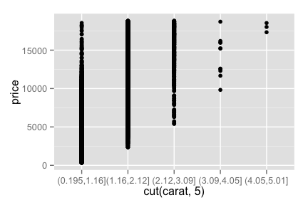
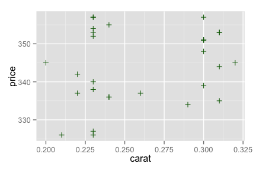
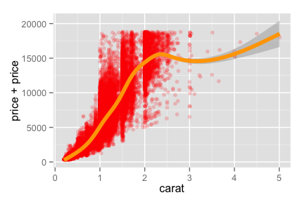

ffplot: a fast, friendly plotting command for R.
================================================

`ffplot` is a simple and intuitive frontend around `ggplot2`. `ffplot`'s
goal is to be usable without thinking.

Status: totally alpha! Download and enjoy.

Install
-------

    library(devtools)
    install_github("hughjonesd/ffplot")

Examples
--------

    library(ffplot)
    data(diamonds, package = "ggplot2")
    d30 <- diamonds[1:30,]
    head(d30)

    ##   carat       cut color clarity depth table price    x    y    z
    ## 1  0.23     Ideal     E     SI2  61.5    55   326 3.95 3.98 2.43
    ## 2  0.21   Premium     E     SI1  59.8    61   326 3.89 3.84 2.31
    ## 3  0.23      Good     E     VS1  56.9    65   327 4.05 4.07 2.31
    ## 4  0.29   Premium     I     VS2  62.4    58   334 4.20 4.23 2.63
    ## 5  0.31      Good     J     SI2  63.3    58   335 4.34 4.35 2.75
    ## 6  0.24 Very Good     J    VVS2  62.8    57   336 3.94 3.96 2.48

Simple scatterplots:

    ffplot(price ~ carat, diamonds)

Plot numeric data by categories:

    ffplot(price ~ color, d30) # TODO: default to violin?

Barplot of categorical data:

    ffplot(cut ~ color, diamonds) 

Density plot, if right hand side is numeric:

    ffplot(cut ~ depth, diamonds, position = "fill") 

Plot a function of your data:

    ffplot(range(price) ~ color, d30) 

Different plot types:

    ffplot(boxplot(price) ~ cut, diamonds)

Multiple plot types and options:

    ffplot(price + line(mean(price), color = "red") ~ cut, d30) 

Mean and confidence intervals. `ffplot` guesses that you want error bars
for the built-in `ci` function:

    ffplot(mean(price) + ci(price, 0.95) ~ cut, diamonds) 

Facets:

    ffplot(price ~ carat | color, diamonds)

Two-way facets:

    ffplot(price ~ carat | color + cut, diamonds)

Add `ggplot2` options:

    library(ggplot2)
    ffplot(cut ~ color, diamonds) + scale_fill_grey()

Use it with `dplyr` or `magrittr`:

    library(dplyr)
    diamonds %>% ffplot(cut ~ color)

Bonus `fftable` function:

    fftable(range(carat) ~ color, diamonds)

    ##   color range(carat).1 range(carat).2
    ## 1     D           0.20           3.40
    ## 2     E           0.20           3.05
    ## 3     F           0.20           3.01
    ## 4     G           0.23           3.01
    ## 5     H           0.23           4.13
    ## 6     I           0.23           4.01
    ## 7     J           0.23           5.01

Cookbook
--------

Plot proportions in a group:

    ffplot(hist(cut, position = "fill") ~ color, diamonds)

Barplot with confidence intervals:

    ffplot(bar(mean(price)) + ci(price, 0.99) ~ color, diamonds) 

Barplot of proportions with binomial confidence intervals:

    ffplot(prop(cut == "Ideal") + ci(cut == "Ideal") ~ color, diamonds)

TODO
----

-   Auto-smoothing for continuous x variables
-   Better ability to override defaults (DONE)
-   More geoms
-   `ci` function for binomial data (DONE)
-   Facetting (DONE)
-   `se` function for standard errors?
-   replace auto-barplot with some kind of `props()` function?
-   How to decide whether to do confidence intervals for proportions or
    counts? I think default to proportions
